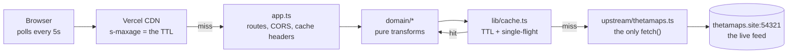

# @susanin/api

Hono on Node, in front of Batumi's live bus feed. **The only thing in this repo
that talks upstream** — the frontend never sees an upstream shape.

```bash
npm run dev --workspace @susanin/api     # :8787, node --watch
npm test --workspace @susanin/api        # node --test, no framework
npm run typecheck --workspace @susanin/api
```

Node strips the TypeScript itself (`--experimental-strip-types`), which is why
relative imports carry a `.ts` extension. They are load-bearing — see the
`tsconfig` notes in the root `CLAUDE.md` before changing them.

## The request path



Two caches, doing different jobs: `lib/cache.ts` bounds upstream load **per
process**, and the CDN collapses every poller in a region into one of those.

| file | what it owns |
|---|---|
| `app.ts` | every `/api/*` route, CORS, and the two cache-header policies |
| `config.ts` | every setting, each with a working default — no env file required |
| `upstream/thetamaps.ts` | the upstream's own PascalCase shapes, and the only `fetch` |
| `domain/model.ts` | the shapes the frontend consumes; nothing upstream leaks past here |
| `domain/network.ts` | dataset → routes, stops, stop chains, shapes, the timetable as trips |
| `domain/schedule.ts` | per-stop times → trips, and the repair of running times no bus could keep |
| `domain/vehicles.ts` | live positions, heading derived from consecutive samples, direction inferred |
| `domain/arrivals.ts` | scheduled departures plus our own live estimates |
| `domain/names.ts` + `names.data.json` | Russian and English stop names, from OpenStreetMap |
| `domain/translit.ts` | Georgian → Cyrillic, the fallback for what OSM has never mapped |
| `domain/geo.ts` | distance, projection onto a polyline, map-matching a chain to a shape |
| `lib/cache.ts` | one TTL cache with single-flight; failures cached too |
| `lib/http.ts` | fetch with timeout and retry |
| `server.ts` | long-running process; the same app also runs serverless |

## Endpoints

    GET /api/health                  liveness + upstream reachability
    GET /api/routes                  all routes, sorted
    GET /api/routes/:id              route + both directions' stop chains + shape
    GET /api/stops[?bbox=s,w,n,e]    all stops
    GET /api/stops/:id               stop + per-route scheduled departures
    GET /api/stops/:id/arrivals      next scheduled times + live estimates
    GET /api/timetable               every direction as trips, for the web app's planner
    GET /api/vehicles[?routes=a,b]   live vehicles, heading derived

## Where the data comes from

| what | source | notes |
|---|---|---|
| routes, stops, timetables, vehicle positions | `https://thetamaps.site:54321` — `/api/getDbData` and `/api/getBusLocsOnRoute?routeId=` | public and unauthenticated; **the origin, not a proxy**. The dataset is 1.27 MB and served without gzip, and positions exist only per route — which is what the cache is for. |
| Russian and English stop names | OpenStreetMap, via Overpass | baked into `domain/names.data.json` at build time by `tools/build-names.mjs`. **© OpenStreetMap contributors, ODbL 1.0** — the licence travels in the file's own metadata and `namesAttribution` is exported so the app can show it. |
| everything else | computed here | arrival estimates, heading, direction, `inService`, route hues, and repaired running times (`estimated: true`). None of it comes from upstream, and the app must not present it as though it did. |

`UPSTREAM_BASE` repoints the feed: at a community mirror in an emergency, or at
`tools/stub-upstream.mjs`, which serves the real dataset with synthetic buses
walking the real polylines — the only way to see live markers after about 20:00,
when the fleet stops and the feed returns `[]`. Never leave a deployment pointed
at the stub.

This project is unaffiliated with Batumi City Hall or any operator.

## What will bite you

- **Never call upstream from a handler.** Every upstream request goes through
  `lib/cache.ts`, so a hundred simultaneous viewers cost one request per key per
  TTL. Positions exist only per route, so "show every bus" is 28 upstream calls;
  this is the whole reason the cache exists. Failures are cached too, briefly —
  caching only successes makes an outage cost *more* than healthy traffic.
- **The TTL cache is per process.** The shared cache is the CDN: every response
  carries `s-maxage` matching its own TTL, and `max-age=0` keeps the browser out
  of it. `app.test.ts` guards the pair.
- **`Status` from the feed is mostly `-1`.** Direction is inferred from geometry
  (`inferDirection`), not read from the field. Reading it as documented puts nine
  buses in ten on the wrong leg.
- **Arrival times are ours**, derived from position along the shape. They are
  estimates, labelled as such, and five rules keep them honest — read the
  arrivals section of the root `CLAUDE.md` before touching them.
- **Some published times are impossible**, and are repaired when the network is
  built: a pattern averaging over 45 km/h is re-derived from distance, and any
  stretch faster than 60 km/h is pushed later. The repair is written back into
  the stop schedules and flagged `estimated`, so every surface gives one time
  for one bus. `network.test.ts` guards both that nothing is too fast and that
  what upstream got right is left byte for byte.
- **`names.data.json` is generated**, by `tools/build-names.mjs`. Fix names by
  adding a hand override there with its reason and re-running, never by editing
  the JSON.
- **The serverless entry lives at the repo root** (`api/index.ts`), not here. It
  must default-export `{ fetch }` — a bare function is read as a Node handler and
  times out silently.

Tests sit beside the code they cover and run the real app through `app.fetch`.
Live ones **skip with a reason** rather than fail when the fleet has stopped for
the night. A guard that cannot be made to go red does not belong here.
