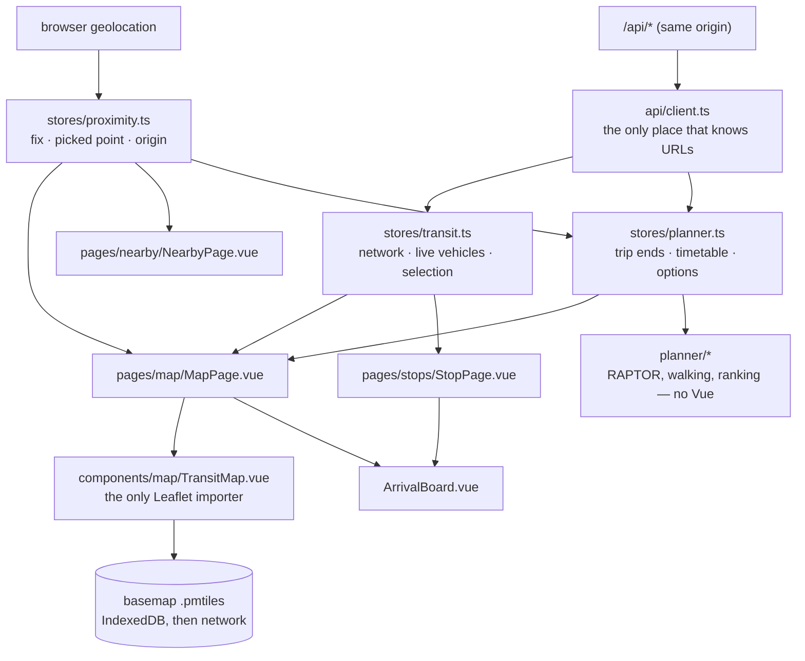

# @susanin/web

Vue 3 + Vite SPA. Built entirely from the
[surstromming](https://github.com/hackteck/surstromming) component library,
consumed from npm exactly as any other user would — nothing vendored, forked or
aliased. It talks only to our own `/api`, never upstream.

```bash
npm run dev --workspace @susanin/web     # :5173, proxies /api to :8787
npm run build --workspace @susanin/web   # vue-tsc -b && vite build
npm test --workspace @susanin/web        # node --test — the journey planner
```

Run `npm run basemap` first on a fresh clone — the map tiles are generated, not
committed, and a missing archive fails as `Wrong magic number for PMTiles` over
a blank map. The root `predev` does this for you.

## How data moves



Search, "nearby" and trip planning run entirely in the browser over the 578 stops
already in the store and the timetable fetched once — no round trip, nothing to be
slow about at a kerb, and no position sent anywhere.

## Layout

| path | what it owns |
|---|---|
| `main.ts` | fonts → reset → `initTheme()` before mount → Pinia → router |
| `App.vue` | the shell: `design.layout(...)`, routed `default` and `sidebar` views, one `Toaster` |
| `api/` | the typed client and the response types — the only place that knows URLs |
| `stores/transit.ts` | the network, the live vehicle feed, and the route selection |
| `stores/proximity.ts` | the fix, and whether a stop was reached from the list of stops near it |
| `stores/planner.ts` | a trip's two ends, when, the timetable, and the options |
| `planner/*` | **the journey planner** — RAPTOR, the walking model, ranking; plain TypeScript, tested with `node --test` |
| `stores/sidebar.ts`, `stores/locale.ts`, `stores/toasts.ts` | app-wide UI state |
| `pages/*` | one folder per page, each with its own route module, lazy-loaded |
| `components/map/TransitMap.vue` | **the only file that imports Leaflet** |
| `components/map/archives.ts` | basemap archives in IndexedDB, validated against the build's sha256 |
| `components/*` | arrival board, route filter, journey planner fields and results, chips, rows |
| `pages/share/SharePage.vue` + `vite.site.ts` | the Share page, and the build step that makes its QR code from `SITE_URL` |
| `composables/*` | arrivals polling, geolocation, the shared one-second clock, theme |
| `i18n/messages.ts` | every UI string in three locales, plus counted nouns |
| `styles/_motion.scss` | motion tokens, and the list of what must **not** animate |

## Key aspects

- **surstromming's `CLAUDE.md` is authoritative for all UI work** — SFC order,
  `<style module lang="scss">`, `$style` in templates, tokens only through
  `design.color()` / `spacing()` / `radius()`, mobile-first, `defineModel()`,
  no `provide`/`inject`. There is **one deliberate deviation**: the map page's
  root is a plain `<main>` that clips, not `<ScrollArea as="main">`, because a
  map owns its own gestures. Every other page keeps the `ScrollArea`.
- **Leaflet is imperative and owns its DOM.** It is wrapped in exactly one
  component that takes data as props and emits intent. Three rules learned the
  hard way, all the same lesson: never bind a reactive `:class` to the element
  Leaflet mounts into, never `setIcon` to update a marker, and call
  `invalidateSize` from a `ResizeObserver` — Leaflet only re-reads its size on a
  *window* resize, and the sidebar collapsing is not one.
- **The basemap is ours**: a self-hosted Protomaps `.pmtiles` pair (detail plus a
  coarse overview so zooming out is not a grey void), rendered to canvas by
  `protomaps-leaflet`. It exists for language — raster OSM tiles are labelled in
  Georgian only, and `name:ru`/`name:en` are what a Russian reader needs. State
  the map's `maxZoom` explicitly; without it Leaflet adopts the widest range its
  *layers* declare.
- **Russian is the default locale**, with Georgian and English beside it. Plurals
  go through `Intl.PluralRules` — Russian needs three forms — and a counted noun
  must agree with what it counts, including the selection ("на линии" for one
  route, "на линиях" for several or none).
- **Picking a route is one gesture everywhere**: the sidebar chip, the bus pill
  and the chip in an arrival row all run the same toggle. The selection is
  session state and is deliberately not persisted.
- **Route colours** cross the wire as a hue integer; the theme supplies lightness
  and chroma. No colour is hardcoded in a component.
- **Offline is the point of the PWA**, not installability: the timetable is
  cached stale-while-revalidate for 14 days, and live positions and arrivals are
  deliberately **never** cached — a cached bus is worse than no bus, because it
  looks current.
- **The UI is not unit-tested; the journey planner is.** The UI is verified in
  the browser over the Chrome DevTools Protocol, per surstromming's rule: what a
  screenshot shows — hierarchy, colour, motion — is where its value is. Whether a
  change of bus leaves time to make it is not in any screenshot, so `planner/`
  stays free of Vue and the DOM and runs under `node --test`, with
  `tsconfig.test.json` checking the tests against Node's types.
- **A trip is the map's business, not the URL's.** `stores/planner.ts` holds the
  two ends; picking one on the map arms the map for that field, a single stop
  chosen opens its arrivals, and a trip focuses the live feed on its own lines
  without touching the route selection.

## Where the data comes from

| what | source | notes |
|---|---|---|
| routes, stops, timetables, live buses | our own `/api`, same origin | the SPA never talks to the transit feed directly and never sees an upstream shape. Inside Capacitor the origin differs, so `VITE_API_BASE` bakes in an absolute URL. |
| the basemap | `public/tiles/*.pmtiles`, cut from a pinned Protomaps planet build by `tools/build-basemap.mjs` | **map data © OpenStreetMap contributors, ODbL 1.0**, rendered by `protomaps-leaflet`. Generated, gitignored, never committed — and required before `dev` or `build`. |
| the site's own address | `SITE_URL` at build time (`.env.example`), through `vite.site.ts` | the Share page's link and QR code, and `index.html`'s link-preview tags. |
| where you are | the browser's geolocation API | asked for only when you press the locate control or choose "my location", and **the fix never leaves the device**: the API client takes no coordinates, and nearest-stop distances and trip plans are computed in the browser. |

Attribution is shown in the app, not only here: the Leaflet control credits
Protomaps and OpenStreetMap, and the About page carries a "where the data comes
from" section in all three languages.

The *why* behind all of the above lives in the root `CLAUDE.md`; this file is
the map of where things are.
